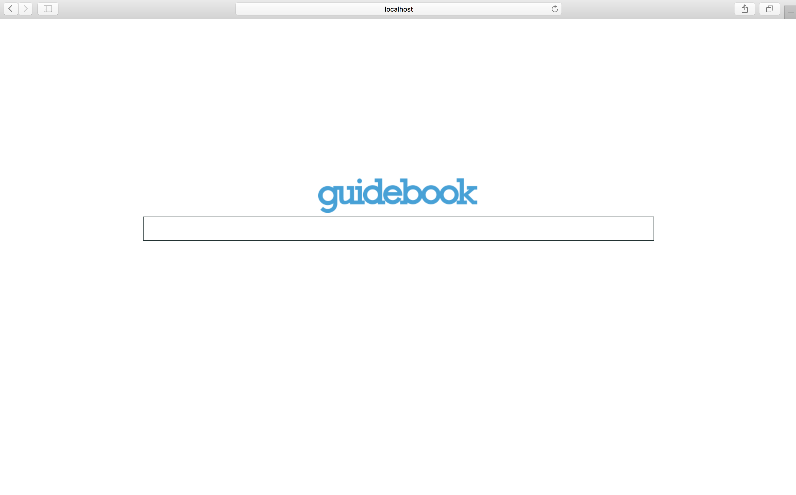

# AutoComplete-App
## Implement
After clonning this git repository, simply direct to the local folder and type the following command
```javascript
npm install
gulp serve
```
You should see this after the app is successfully runned,Yah!


## Folder Structure
I'm using gulp to serve this application locally, therefore there are two folders in this app. The app folder is where the source file located. While the Build folder is where the distribution files located.

## Thinking Process of the app
The main idea for this app is simple: 
Whenever user input some value, it will go through some validation, if it matches the search requirement, it will be sent to Trie for searching and return the search result to the web page. If the user input doesn't match the search request(like less than three characters), it will also render back a message to inform user. 

I want this application to be <strong>straightforward, clean and easy to grow bigger.</strong> Some of the main ideas are as follows.

1. I choose Gulp to serve this app because it allows me to see the change automatically without refreshing the web page. Besides, it is clear to see where I went wrong in the terminal when an error is occured.

2. The application is mainly for searching through the city list and return results. The first thing to consider is the searching. Trie is the ideal data structure for searching, especailly when the data set is large. 
Therefore the first thing to do is writing the Trie structure and some prototype methods like put() and getall(). put() is for creating the Trie based on the list, getall() is for search for all the name that match the input in Trie.

3. The second part is for writing the component. I split the codes into three components, the trie, searchbox and dataEndpoint. Trie is for the searching Tree, searchBox is mainly for collecting data, changing UI and rendering DOM, dataEndpoint is the data file.  
Therefore, it would be much clearer to see the logic of the application and it would be easier to add new features or change the dataset without going deep into the codes.

4. When writing the JSX file, I paid attention to decrease the use of State and minimize the re-render times. Because these little things coule help to make codes cleaner and makes it easier for others to read.
